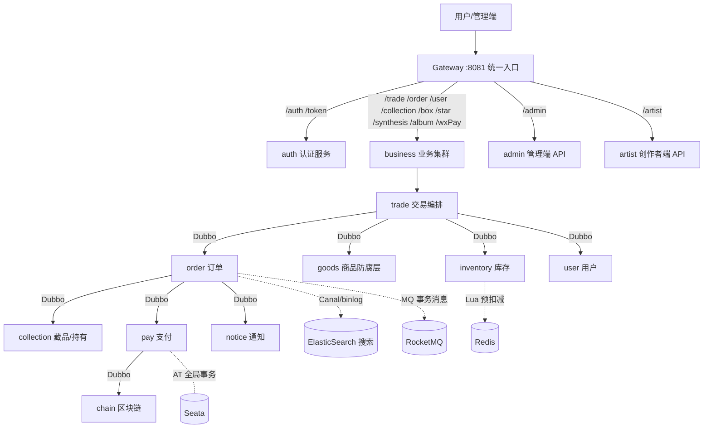
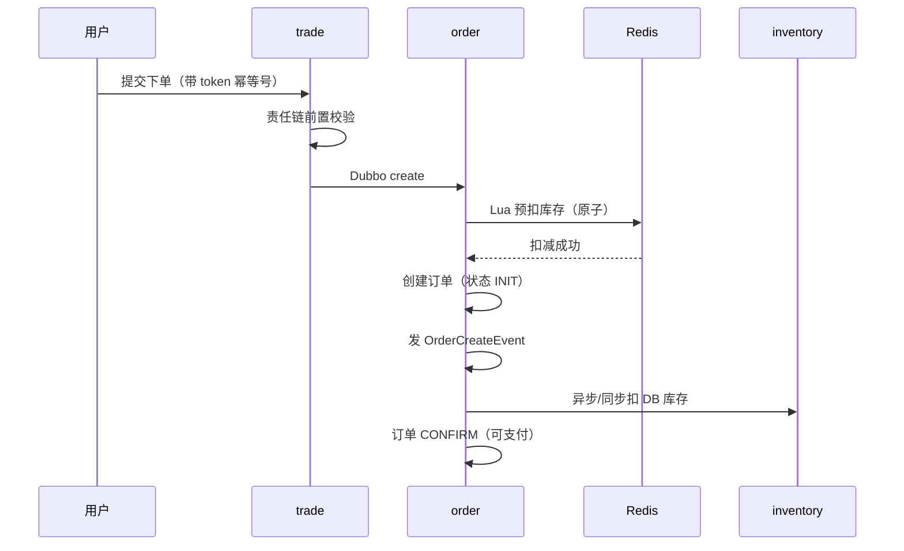
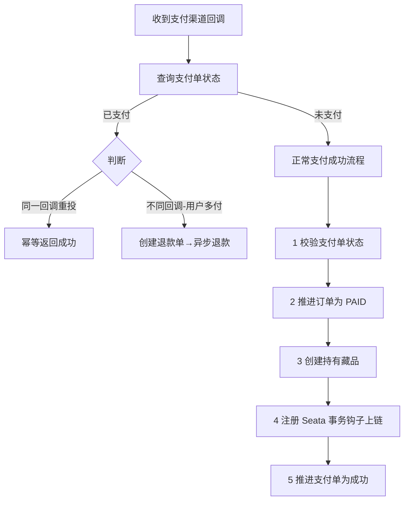
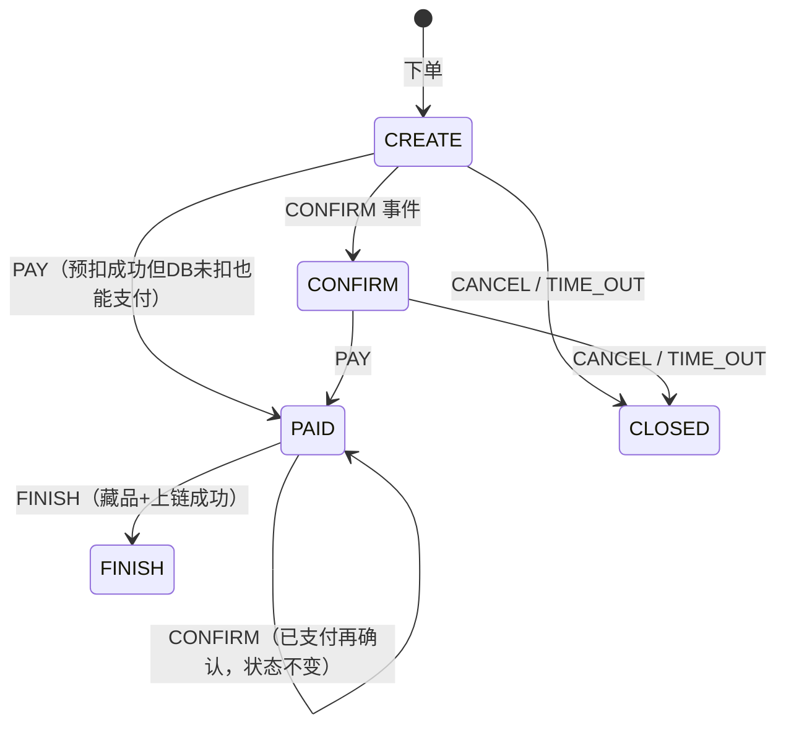

# NFTurbo 项目面试全解（代码为准版）

> **本文定位**：一份可以当"面试作答手册"逐节背的项目全解——整体流程 → 架构 → 框架选型 → 业务流程 → 高并发/一致性专题 → "为什么不"问答 → 量化指标。
>
> **事实基准**：以**磁盘上的实际代码**为准。代码包名是 `cn.yueyu.nft.turbo`（**不是**课程文档里的 `cn.hollis.nft.turbo`），groupId 为 `cn.yueyu`（见 `pom.xml:9`）。`hollis-nft-document/` 下的 200 篇文档代表**原始课程版设计意图**，与当前代码存在若干差异，凡关键差异本文均已标注 `⚠️ 代码 vs 文档`，并给出 `文件:行号` 锚点。
>
> **关于"数据量化"**：经逐篇核验，课程文档 `最佳实践/`（29 篇）中**几乎没有 QPS / P99 / 内存吞吐等硬性收益数字**，出现的数字绝大多数是**配置参数与版本号**。因此本文第 7 节只列"有据可查的参数化指标"，不编造压测数字——这本身也是面试时更稳妥的策略（见 7.2）。

---

## 一、项目定位与整体流程

### 1.1 这是什么项目，为什么适合面试

NFTurbo 是一个 **NFT 数字藏品交易平台**（数藏 = 电商 + 区块链）。它的面试价值在于四个属性叠加：

| 属性 | 说明 | 面试可直接讲的点 |
|------|------|------------------|
| **高并发** | 数藏有"抢购/秒杀"天然场景 | 库存热点扣减、Lua 预扣减、限流降级 |
| **微服务** | 认证/用户/订单/支付/藏品/链等模块多 | 服务拆分、Dubbo RPC、网关统一鉴权、Seata |
| **区块链** | 底层是链上资产 | 上链/铸造/转让/销毁、外部链对接、一致性 |
| **业务真实** | 数藏不是垄断赛道，蚂蚁鲸探等大小厂都在做 | 项目真实性不易被质疑 |

数藏业务本身比纯电商**更简单**（几乎没有复杂逆向、营销、结算），但**秒杀、支付、库存、搜索**这些核心难点一个都不少——"业务简单 + 技术难点全"，非常适合作为面试项目。

### 1.2 端到端主流程（一张图看懂）



**一句话主链路**：用户在 **trade** 模块下单 → trade 编排 **order**（建单）+ **inventory**（Redis 预扣库存）→ 生成支付单 → 调用**微信支付** → 支付回调触发 **pay.paySuccess**（Seata AT 全局事务）→ 推进订单为 PAID、真正扣库存、创建**持有藏品** → 通过 **Seata 事务钩子**在事务提交后调 **chain** 上链 → 订单 FINISH。

### 1.3 角色与端

| 角色 | 端 | 前缀 | 鉴权 |
|------|----|------|------|
| 普通用户 CUSTOMER | Client（Vue + uni-app 跨端） | `/user` `/order` `/trade`… | BASIC（登录）/ AUTH（实名） |
| 创作者 ARTIST | Artist API | `/artist/**` | ARTIST 角色 |
| 管理员 ADMIN | Admin（React + UmiJS Max + antd） | `/admin/**` | ADMIN 角色 |
| 未登录游客 | H5 | `/collection/collectionList` `/box/boxList` `/wxPay/**` 等白名单 | 无 |

角色/权限枚举定义在 `UserRole`（CUSTOMER/ARTIST/ADMIN）与 `UserPermission`（BASIC/AUTH/FROZEN/NONE）。

---

## 二、技术栈、框架选型与版本迭代

### 2.1 后端技术栈（✅ 版本实测自 `pom.xml`）

| 分类 | 技术 | 版本 | 证据 |
|------|------|------|------|
| 语言 | Java | **21** | `pom.xml:19` |
| 框架 | Spring Boot | **3.2.2** | `pom.xml:20` |
| 微服务 | Spring Cloud | **2023.0.0** | `pom.xml:21` |
| 微服务 | Spring Cloud Alibaba | **2023.0.1.2** | `pom.xml:22` |
| RPC | Apache Dubbo | **3.2.10** | `pom.xml:23` |
| RPC 注册中心 | Nacos | — | — |
| 网关 | Spring Cloud Gateway | 4.1.0 | 文档 `技术栈一览` |
| 序列化 | Fastjson2 | 2.0.42 | `pom.xml` |
| ORM | MyBatis 3.0.3 / MyBatis-Plus 3.5.5 | — | 文档 `Mybatis-Plus接入` |
| 连接池 | Druid | 1.2.20 | `datasource-sharding.yml` |
| 分库分表 | ShardingSphere-JDBC | 5.2.1 | 文档 `ShardingJDBC接入` |
| 认证 | Sa-Token | 1.37.0 | 文档 `Sa-Token接入` |
| 缓存 | Redis + Redisson 3.24.3 + Caffeine 3.1.8 + JetCache 2.7.5 | — | `nft-turbo-cache` pom |
| 分布式事务 | Seata | 2.0.0 | 文档 `Seata接入` |
| 消息 | RocketMQ | 5.1.4 | 文档 |
| 定时任务 | XXL-Job | 2.4.0 | 文档 |
| 搜索 | ElasticSearch + Kibana | 8.13.0 | 文档 |
| 数据同步 | Canal | 1.1.7 | 文档 |
| Bean 拷贝 | MapStruct | 1.6.0.Beta1（processor 1.5.5.Final） | `pom.xml` |
| 工具 | Hutool 5.8.22 / Guava 32.1.3-jre / Lombok 1.18.30 | — | `pom.xml` |

> ⚠️ **代码 vs 文档**：课程 `技术栈一览.md` 把 Spring Cloud Alibaba 写成 `2022.0.0.0`，实际 `pom.xml` 是 **`2023.0.1.2`**。以代码为准。

### 2.2 前端技术栈

| 端 | 技术 | 端口 | 代码位置 |
|----|------|------|----------|
| Admin 管理后台 | React 19 + UmiJS Max 4.6 + antd 6.5 + ProComponents 2.8 + TS 5.7 | 8000 | `NFTurbo_Admin/` |
| Client 用户端 | Vue 3 + uni-app 4 + uview-plus + Pinia + TS（H5/App/小程序跨端） | 8084 | `NFTurbo_Client/` |

### 2.3 框架选型理由（逐项 why / 对比 / 好处）

> 面试问"为什么用 X"，先答**业务约束**，再答**对比**，最后答**收益**。以下均来自项目 `为什么不/` 与 `4.框架接入/` 的论证。

#### (1) 为什么用 Dubbo 而不是 OpenFeign？
- **理由1（现实）**：团队更熟 Dubbo；且 Feign/OpenFeign 官方已停止推进新特性（Spring Cloud 2020 起 Feign 不再维护，2022 起 OpenFeign 被视为"功能完整"，只修 bug）。
- **理由2（技术）**：Dubbo 是 **RPC 框架**，自带服务治理（服务发现、负载均衡、故障转移、动态配置）；Feign 是 **HTTP 客户端**，负载均衡/熔断要额外配 Ribbon/Hystrix，且 HTTP 协议的开销比 RPC 私有协议大、性能更低。

#### (2) 为什么一个应用里还要用 Dubbo？为什么一个库还要用分布式事务？
- 项目**为了降低部署成本，把多个 Application 放在同一个 Maven 工程里**，每个启动类其实是一个独立应用（`NfTurboOrderApplication`、`NfTurboPayApplication`…）。
- 同理，所有表放在同一个 `nfturbo` 库里是为了省事；**生产上用户/订单/藏品应是各自独立的库**。
- 因此跨模块调用必须走 Dubbo、跨模块写数据必须用分布式事务——**现在拆得开，才证明架构是对的**。

#### (3) 为什么 Gateway 用 LoadBalancer，Dubbo 不也能负载均衡？
- 两者**职责不同、层级不同**：LoadBalancer 做的是 **HTTP 入口请求**的负载均衡（`/trade/xxx` → trade 某实例）；Dubbo 做的是 **服务间 RPC 调用**的负载均衡（trade 调 order 时选哪个 order 实例）。
- 二者**都基于 Nacos 做服务发现**，拿到 IP 列表后按策略负载。

#### (4) 为什么用 Sa-Token 而不是 Spring Security / OAuth2？
- 轻量、API 简单（`StpUtil.checkLogin()` / `checkRole()` / `checkPermission()`），适合**微服务 + 网关统一鉴权**场景；项目用 `sa-token-reactor-spring-boot3-starter` 在 **Gateway（WebFlux）** 层做统一校验，业务服务只取 `StpUtil.getLoginId()`。

#### (5) 为什么用 ShardingSphere-JDBC 做分库分表？
- 市面上可选不多，且它**以 JDBC Driver 形式**接入，对 MyBatis/MyBatis-Plus 完全透明，**支持自定义分片算法与全局 ID**——这两点本项目都重度使用（基因法 + 雪花）。

#### (6) 为什么用 RocketMQ？为什么**不**用 MQ 做支付单到期关闭？
- 项目用 RocketMQ 主要承载 **订单取消的事务消息**（保证"关单 + 回退库存"最终一致）。
- 但**支付单/订单超时关闭不用 MQ 延迟消息**，理由（阿里 TOC 超时中心同思路）：① 大量订单会造成 MQ 消息积压、成本高；② MQ 无法 100% 不丢消息，有可靠性风险；③ 大部分订单会提前取消/支付，**大量无效延迟消息**浪费资源；④ 扩展性差。→ 改用 **XXL-JOB 定时任务 + 分片扫表 + 生产者消费者 + 线程池**，并辅以**主动关单**。

#### (7) 为什么引入 Seata（AT）而不用纯 MQ？是不是太重？
- 支付成功这个场景**参与者多**（订单、支付、藏品、链），用 MQ 需要多方监听同一消息，链路过于异步、侵入高。
- 相比 TCC（侵入高）、XA（重），**AT 侵入最低、性能可接受、一致性比 MQ 更强**，故 AT 是首选。
- "重不重是相对的"——论坛/社区类项目 MQ 都嫌重，但支付场景天然需要协调者，**合适 > 轻**。项目最终用了 **4 种一致性方案**（见 5.5），正是"因地制宜"的体现。

### 2.4 版本迭代时间线（来自 `更新情况/Timeline_2024_06~09.md`）

这是回答"项目迭代了什么 / 解决了什么问题"的一手素材：

| 月份 | 主要迭代 | 解决的问题 / 引入的技术 |
|------|----------|------------------------|
| **06** | Gateway+auth 启动、用户注册登录（分布式锁/布隆过滤器/缓存）、短信验证码、`sa-token`/`mybatis-plus`/`logback`/`redisson` 接入、藏品搜索上 ES、Seata & Sentinel 部署 | 搭建地基；**bugfix**：短信验证码校验失败、订单分页、lua 扣减失败、责任链失效、Mock 链异常 |
| **07** | 订单号生成（雪花+银行自增）、下单链路（热点瓶颈/充血模型/幂等/责任链）、秒杀 Redis 预扣减、商品 goods 防腐层（switch 表达式）、接入 Seata、RocketMQ 事务消息、用户邀请+ZSET 排行榜、**调整库存逻辑新增库存流水表** | **代码新增**：`update:移除对已失效的 sharding 包的仲裁`；**bugfix**：Facade 单独应用不生效、扫表死循环/跳页、延迟任务失效 |
| **08** | 订单分库分表（一~四）、Seata 事务钩子+定时任务保上链一致、主动+被动关单、重复支付自动退款、`like` 索引失效优化、Dubbo 反序列化修复 | **性能**：订单扫表 `like` 走不了索引 → 优化；**bugfix**：事务消息回调异常、库存幂等失败、用户邀请码未进 bloomfilter、分布式 ID 获取 business/seq 异常 |
| **09** | 支付单模型/状态机、微信支付对接（IJPay）、自定义手机号校验注解、后台管理（藏品库存/价格修改） | **重构**：支付模块；**bugfix**：支付成功回调移除多余本地事务、用户注册后不再多余反查、取消 `collection.identifier` 字段 |

---

## 三、架构设计

### 3.1 系统架构：微服务拆分（✅ 实测自磁盘）

根 `pom.xml` 聚合 7 个顶层模块：`nft-turbo-common / auth / gateway / business / admin / check / artist`。

```
nft-turbo/
├── nft-turbo-gateway/        # 网关 :8081（路由 + 统一鉴权 + 限流）
├── nft-turbo-auth/           # 认证服务（登录/发 token，写 Redis）
├── nft-turbo-admin/          # 管理端 API（Admin 前端后端）
├── nft-turbo-artist/         # 创作者端 API :9002
├── nft-turbo-check/          # 对账校验
├── nft-turbo-business/       # 业务集群（多启动类，同工程便于部署）
│   ├── nft-turbo-app/        #   business 启动入口（聚合装配）
│   ├── nft-turbo-trade/      #   交易编排（对客，含 Controller）
│   ├── nft-turbo-order/      #   订单（仅 Dubbo 对客）+ 分库分表
│   ├── nft-turbo-pay/        #   支付（微信支付对接、退款、对账）
│   ├── nft-turbo-inventory/  #   库存（Redis Lua 预扣减）
│   ├── nft-turbo-goods/      #   商品防腐层（聚合层）
│   │   ├── nft-turbo-interface/  # 商品聚合接口
│   │   ├── nft-turbo-collection/ # 藏品
│   │   ├── nft-turbo-box/        # 盲盒
│   │   └── nft-turbo-star/       # 星尘（虚拟权益）
│   ├── nft-turbo-chain/      #   区块链（文昌链）
│   ├── nft-turbo-user/       #   用户
│   ├── nft-turbo-notice/     #   通知（短信）
│   ├── nft-turbo-series/     #   系列
│   ├── nft-turbo-synthesis/  #   合成（玩法）
│   └── nft-turbo-album/      #   图鉴（玩法）
└── nft-turbo-common/         # 公共库（19 个 starter）
    ├── nft-turbo-api/         #   API 契约（DTO + Facade 接口）
    ├── nft-turbo-base/        #   基础工具（异常/状态机/Money/校验）
    ├── nft-turbo-cache/       #   缓存（Redis+Redisson+Caffeine+JetCache）
    ├── nft-turbo-config/      #   配置中心
    ├── nft-turbo-datasource/  #   数据源 + 分片算法
    ├── nft-turbo-es/          #   ElasticSearch
    ├── nft-turbo-file/        #   文件/OSS
    ├── nft-turbo-job/         #   定时任务（XXL-Job）
    ├── nft-turbo-limiter/     #   限流（Sentinel + Redisson 滑动窗口）
    ├── nft-turbo-lock/        #   分布式锁（Redisson + 注解 + AOP）
    ├── nft-turbo-mq/          #   消息（RocketMQ）
    ├── nft-turbo-order-client/#   订单客户端（分片 ID/策略）
    ├── nft-turbo-rpc/         #   RPC（Dubbo + @Facade 切面）
    ├── nft-turbo-sa-token/    #   认证组件
    ├── nft-turbo-seata/       #   分布式事务（含重写的 ShardingSphere 类）
    ├── nft-turbo-skywalking/  #   链路追踪
    ├── nft-turbo-sms/         #   短信
    ├── nft-turbo-tcc/         #   TCC 事务
    └── nft-turbo-web/         #   Web 通用
```

> ⚠️ **代码 vs AGENTS.md**：AGENTS.md 写的模块地图是简化版（把 `box/collection/star` 写成 `collection/box` 并漏掉 `series/album/synthesis`、`skywalking/tcc/order-client/web/datasource/limiter/lock/sms/es` 等）。**实际 common 有 19 个 starter、business 有 12 个子模块**，以上为代码实测。

### 3.2 DDD 四层 + 多功能入口分层

项目对订单/支付等核心模块做了清晰的分层（`代码分层.md` 描述，代码目录结构可对应）：

| 层 | 职责 | 典型类 |
|----|------|--------|
| **controller** | HTTP 入口（仅对客模块有，如 trade/user） | `trade/controller/TradeController.java` |
| **facade** | RPC 入口（Dubbo 对外） | `order/facade/OrderFacadeServiceImpl.java` |
| **job** | 定时任务入口 | `order/job/OrderJob.java` |
| **listener** | MQ/事件消费入口 | `order/listener/OrderCloseTransactionListener.java` |
| **application** | 应用层，编排多个领域服务 | `pay/application/service/PayApplicationService.java` |
| **domain** | 领域层，领域服务 + 实体 + 状态机 | `order/domain/service/OrderManageService.java` |
| **infrastructure** | 基础设施（渠道对接、Mapper、工具） | `pay/infrastructure/channel/...` |

**调用关系**：入口层（controller/facade/job/listener）→ application → domain → infrastructure。

### 3.3 网关与统一鉴权

网关 `application.yml` 路由（✅ 实测）：

```yaml
routes:
  - id: nfturbo-auth
    uri: lb://nfturbo-auth
    predicates: [Path=/auth/**,/token/**]
  - id: nfturbo-business
    uri: lb://nft-turbo-business
    predicates: [Path=/trade/**,/order/**,/user/**,/collection/**,/box/**,/star/**,/synthesis/**,/album/**,/wxPay/**]
  - id: nfturbo-artist
    uri: lb://nfturbo-artist
    predicates: [Path=/artist/**]
```

> ⚠️ **代码 vs 文档**：`Gateway网关设计.md` 里路由只有 `/trade,/order,/user,/collection,/wxPay`，且鉴权段出现 `/orders/**`（与路由 `/order/**` 不一致）；**实际代码**已补上 `/box,/star,/synthesis,/album`，说明玩法模块上线后同步扩了路由。

统一鉴权在网关用 **Sa-Token 的 `SaReactorFilter`** 实现（Gateway 是 WebFlux，不能只用 Servlet 那套）：
- 登录拦截：`SaRouter.match("/**").notMatch("/auth/**","/collection/collectionList","/collection/collectionInfo","/wxPay/**").check(r -> StpUtil.checkLogin())`
- 角色/权限：`/admin/**` → `checkRole(ADMIN)`；`/trade/**` → `checkPermission(AUTH)`（实名）；`/user/**` → `checkPermission(BASIC)`
- **统一限流**：集成 Sentinel（网关层抗流量，避免下游被打挂）
- **日志脱敏**：`sensitive-logback`

### 3.4 公共组件体系：一切皆 Starter

项目的"工程亮点"之一是**把可复用能力都封装成独立 Spring Boot Starter**（`6.公共组件/`）：
- 每个组件 = 依赖封装 + Bean 定义 + 默认配置 + 自定义扩展；通过 `META-INF/spring/...AutoConfiguration.imports` 生效（SpringBoot 3 已废弃 `spring.factories`）。
- 例：`nft-turbo-lock` 只依赖 `nft-turbo-cache`，内部用 **Redisson + 自定义注解 `@DistributeLock` + AOP 切面** 实现分布式锁；`nft-turbo-limiter` 封装 Sentinel + Redisson `RRateLimiter` 滑动窗口。

**收益**：微服务引入一个 starter 即可获得整套能力，配置集中在 `cache.yml`/`rpc.yml`/`limiter.yml` 等，减少重复配置。

### 3.5 数据架构

| 存储 | 用途 | 关键点 |
|------|------|--------|
| MySQL `nfturbo` | 主数据（用户/订单/藏品/支付…） | 订单表分 4 片；金额 `decimal(18,6)` |
| Redis | 库存预扣减、登录态、缓存、限流、排行榜 | Lua 原子扣减；ZSET 排行榜 |
| ElasticSearch | 藏品搜索、深分页 | Canal 监听 binlog 同步；`search_after` 深分页 |
| RocketMQ | 订单取消事务消息、库存扣减消息 | `producerType: Trans` |
| Seata | 支付链路分布式事务 | AT 模式 + 事务钩子 |

（业务流程图见下一节。）

---

## 四、核心业务流程（逐条拆解）

> 下面每个流程都按"**做什么 → 怎么做（关键类/表/技术）→ 亮点**"组织，可直接当面试讲解稿。

### 4.1 注册 / 登录 / 认证 / 实名

**流程**：
1. **发送验证码**：`notice` 模块 → 自定义注解校验手机号 → **Redisson 分布式锁**防重发 → **Redisson 滑动窗口限流**（同一手机号 N 秒内只能发一次）→ 调第三方短信发送。
2. **注册**：先查 **BloomFilter**（用户名/邀请码判重，容量 1000 万、误判率 0.01）→ **分布式锁**保证并发唯一 → 写库 → 用户名/邀请码入 BloomFilter → 发欢迎短信。
3. **登录**：`auth` 模块用 **Sa-Token** 完成登录并写 Redis（分布式 Session）→ 返回 `userId / token / tokenExpiration`。
4. **实名认证**：对接第三方实名 → 成功后**创建链账户**（`chain.createAddr`，用户要有链账户才能交易）→ 身份证号等敏感字段**加密存储**（`AesEncryptTypeHandler` + `AesUtil`）。
5. **鉴权**：业务接口一律用 `StpUtil.getLoginId()` 取 userId，**不信任前端传参**（防水平越权）。

**关键表**：`users`（含 `nick_name / state(ACTIVE,FROZEN) / telephone / certification / id_card_hash / block_chain_url`）、`user_operate_stream`（操作流水）。

**亮点**：BloomFilter 判重 + 分布式锁兜底；隐私字段加密 + 响应脱敏（`SensitiveResponseBodyAdvice`）；邀请码走 ZSET 排行榜。

### 4.2 商品与藏品

**goods 是"防腐层"**：把底层具体商品类型屏蔽掉，供 trade/order 统一调用，**自身不做持久化存储**。
- `BaseGoodsVO`（抽象类）定义 `getGoodsName/getGoodsPicUrl/getSellerId/getVersion/available/getPrice`；`CollectionVO extends BaseGoodsVO` 实现之。
- `GoodsFacadeService.getGoods` 用 **switch 表达式**按 `GoodsType` 分发（当前 `COLLECTION`，未来可扩 `BOX/HELD_COLLECTION`）。
- 商品售卖状态由一个 `setState(...)` 方法根据**状态 + 是否到发售时间 + 是否有库存**计算（`SELLING / SOLD_OUT / COMING_SOON / WAIT_FOR_SALE / NOT_FOR_SALE`），`DEFAULT_MIN_SALE_TIME = 60` 分钟。

**藏品相关表**（5 张）：
| 表 | 作用 |
|----|------|
| `collection` | 藏品主表（名称/封面/价格/库存 `quantity/saleable_inventory/occupied_inventory`/状态） |
| `held_collection` | 持有藏品（购买后生成，含持有者、序列号 `serial_no`、`nft_id`、`tx_hash`） |
| `collection_stream` | 藏品变更流水 |
| `collection_snapshot` | 藏品快照（改价/改图生成新版本，供订单回溯下单时信息） |
| `collection_inventory_stream` | 库存变更流水（幂等 + 对账） |

**藏品状态机**：`INIT`（创建）→ `SUCCEED`（上链成功）→ `REMOVED`（销毁）。

### 4.3 下单 + 库存预扣减（秒杀核心）

这是全项目最核心的链路。**库存方案没有单纯选"下单扣"或"支付扣"，而是二者结合——下单预扣、支付真扣**：

| 方案 | 优点 | 缺点 |
|------|------|------|
| 下单扣库存 | 实时、简单、防超卖 | 取消/超时要回滚；**下单并发高，热点集中**；支付失败易少卖 |
| 支付扣库存 | 避免少卖/订单浪费；取消无需回滚；支付并发低于下单 | 有超卖风险（多人下单后库存不够） |
| **本项目：下单预扣 + 支付真扣** | 兼顾：下单锁库存一段时间，超时释放；**把真正的 DB 扣减推到低 QPS 的支付环节** | 需要补偿机制（见 4.5 少卖） |

**库存三字段恒等式**（`collection` 表）：
```
quantity >= 0
saleableInventory >= 0
occupiedInventory >= 0 && occupiedInventory <= quantity
saleableInventory + occupiedInventory <= quantity
```

**下单主流程**（秒杀链路）：


**关键实现（✅ 代码锚点）**：
- **Lua 预扣减**：内嵌于 `nft-turbo-inventory/.../domain/service/impl/AbstractInventoryRedisService.java:68`（Java 文本块），逻辑含：
  - `redis.call('hexists', KEYS[2], ARGV[2]) == 1` → 幂等：`return redis.error_reply('OPERATION_ALREADY_EXECUTED')`
  - `local current = redis.call('get', KEYS[1])` → 取库存，`false` 则 `KEY_NOT_FOUND`
  - `local new = tonumber(current) - tonumber(ARGV[1])` → 扣减
  - ⚠️ 项目约定：**Lua 中用 `false`/`0` 替代 `nil`**，Java 端判空（`常见陷阱`）。
- **幂等 token 防重复提交**：商品详情页下发一次性 token，下单时校验（**注意**：这个 token 与登录的 sa-token **不是一回事**，只是同名）。
- **下单入口加分布式锁**：`@DistributeLock(keyExpression="#request.identifier", scene="ORDER_CREATE")`（见 5.6）。
- **前置校验用责任链模式**（`orderValidatorChain.validate`）。

### 4.4 支付（回调 / 幂等 / 重复支付 / 对账）

**支付单模型**：`pay_order` 表**不含任何订单信息**（没有 `order_id/buyer_id`），而是定义支付域自己的属性（付款方/收款方/**业务单号 bizNo**），目的：**更通用、更内聚**。另有一张 **退款单 `refund_order`** 支持多付退款。

**支付成功回调**（`PayApplicationService.paySuccess`，`@GlobalTransactional`，实测 `PayApplicationService.java:147`）分三种情况：


**幂等控制"一锁、二判、三更新"**：生成支付链接时按此三步做幂等（`generatePayUrl` 加 `@DistributeLock`）。

**重复支付**：同一订单被多个渠道支付成功时，订单层用**状态机 + 乐观锁**保证只推进一次；回调发现订单已支付且不是本次回调 → 触发退款（`doChargeBack` 用 **`Thread.ofVirtual()` 虚拟线程**异步执行退款，失败交定时任务重试——`PayApplicationService.java` 实测）。

**对账**：`pay/job/` 下 `PayBillPullJob`（拉账单）、`PayDetailCheckJob` / `PayOrderCheckJob`（对账）、`PayOrderTimeOutJob`（超时关闭）、`RefundOrderRetryJob`（退款重试）；对账不一致记录进 `PayCheckMismatchDetail`。

**亮点**：支付单/订单解耦；多付自动退款；支付与上链的一致性用 **Seata 事务钩子**（见 4.6）；全程**不滥用分布式锁**（见 6.x）。

### 4.5 订单确认与关闭（超时 / 主动）

**订单状态机**（`OrderStateMachine extends BaseStateMachine<TradeOrderState, TradeOrderEvent>`，`order/domain/entity/statemachine/`）：

> 订单**故意没有 PAYING 状态**：支付可能被多次发起（换渠道/取消再发起），状态会反复横跳，引入了反而更复杂。

**订单确认（CREATE → CONFIRM）**：
- 原方案是**异步事件**（`OrderCreateEvent` + 监听器），起到缓冲/解耦作用。
- ⚠️ **代码 vs 文档（重要迭代证据）**：`OrderEventListener.java:24-25` 注释明确写着——
  > *"移除异步处理，本事件改为同步处理。因为在后面的**压测**中发现，异步处理会导致整体的订单 CONFIRM 延迟变长，影响用户体验，所以改为同步调用的方式。"*
  **这是项目"以压测数据驱动优化"的真实案例**：文档还写着异步缓冲，代码已按压测结论改回同步（`@TransactionalEventListener`）。

**订单关闭（→ CLOSED）**：`closeType` = `CANCEL`（用户取消）或 `TIME_OUT`（超时）。
- **用户取消**：为保证"关单 + 回退库存"一致，用 **RocketMQ 事务消息**（`order` 模块 `spring.cloud.function.definition: orderClose`，生产者 `producerType: Trans`，`transactionListener: orderCloseTransactionListener`）。
- **超时关单**：**XXL-JOB 定时任务**（`OrderJob`：`@XxlJob("orderTimeOutExecute")`），配合**分片任务**加速扫表 + **生产者消费者 + 线程池**并发消费，并辅以**主动关单**（用户访问订单时顺带判断是否需关单）。
- 为什么不用 MQ 延迟消息做超时关单？见 2.3(6) / 6.x。

### 4.6 上链（铸造 / 转让 / 销毁）

**区块链模块**把链操作抽象为一组方法（`ChainFacadeService`）：`createAddr`（建账户）/`chain`（上链模板）/`mint`（铸造实例）/`transfer`（转让）/`destroy`（销毁）。
- **上链 = 模板**（如"发行 100 份电影票"，上链一次即可）；
- **铸造 = 基于模板造实例**（铸造依赖上链，铸造后需归属人 → 就是之前建的链账户）；
- **转让 = 实例转手**（归属人变更）；**销毁**= 放弃。

**设计亮点（设计模式）**：
- **工厂模式**：`ChainServiceFactory` 按 `ChainType` 选 `WenChangChainServiceImpl`（文昌链）或 `MockChainServiceImpl`（Mock），`get()` 里用 `BeanNameUtils.getBeanName(chainType.name(), "ChainService")` 从 Map 中取。
- **模板方法**：`AbstractChainService` 定义链操作骨架，子类实现差异步骤。

**支付成功 → 上链的一致性**（关键难点，`关键技术/分布式一致性方案`）：
- 前 5 步（推进订单/扣库存/建持有藏品/推支付单）放在 **Seata AT 全局事务**里；
- 第 6 步"上链"要调**外部链平台**，不可靠，**不能放进事务**（会导致事务频繁回滚）。→ 注册 **Seata `TransactionHook`**，在事务 **commit 之后**回调 hook 执行上链（`PayApplicationService` 中 `TransactionHookManager.registerHook(new PaySuccessTransactionHook(...))`），失败则由**定时任务 `ChainProcessJob` 重试**。

**链操作表**：`chain_operate_info`（chain_type/biz_id/operate_type/state/param/result…），链路操作状态机 `ChainOperateStateEnum`。

### 4.7 玩法：合成 / 盲盒 / 图鉴（✅ 代码实测，文档未覆盖）

> 玩法模块在 AGENTS.md 标注"待实现"，但**实际代码已落地**——以代码为准。

- **合成 synthesis**：`SynthesisController` + `SynthesisServiceImpl`，用**责任链/校验器链**（`BaseSynthesisSubmitValidator` → `MaterialValidator`/`RecipeValidator`/`StarBalanceValidator`）；有配方 `SynthesisRecipe`、流水 `SynthesisStream`、状态 `SynthesisStateEnum`、事件 `SynthesisSubmittedEvent`、定时任务 `SynthesisJob`。
- **盲盒 box**：`nft-turbo-goods/nft-turbo-box`，有 `blind_box_sqlmap.xml`（含 InventoryHint 扣减 SQL）。
- **星尘/星尘 star**：`nft-turbo-goods/nft-turbo-star`，虚拟权益；对应 `StarInventoryRedisService`。
- **图鉴 album**：`AlbumController` + `AlbumServiceImpl`，进度 `UserAlbumProgress`、里程碑 `AlbumMilestoneConfig`、奖励 `AlbumRewardRecord`、进度监听 `AlbumProgressListener`。
- **系列 series**：`SeriesManageFacadeServiceImpl` / `SeriesReadFacadeServiceImpl`。

### 4.8 用户邀请与排行榜

- 邀请：用户填邀请码注册 → 邀请人积分累加。
- 排行榜：用 **Redis ZSET**（`inviteRank.add(score, inviterId)`）实现；`updateInviteRank` 里**手动 `rLock.lock()`** 而非 `@DistributeLock`——因为**该方法私有，AOP 注解拦截不到**（这也是个面试小知识点）。

### 4.9 通知（短信）

`notice` 模块：`NoticeService` + `NoticeFacadeServiceImpl` + `NoticeSendRetryJob`（发送失败重试）+ `NoticeType/NoticeState`。短信发送前走限流与分布式锁（见 4.1）。
