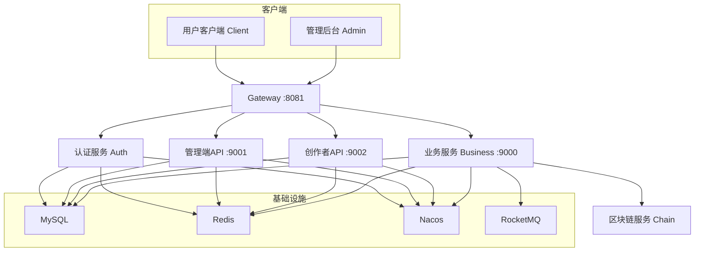

# NFTurbo - NFT数字藏品交易平台

> 一个基于 Spring Cloud Alibaba 微服务架构的 NFT 数字藏品交易平台，项目处于开发阶段，主要作为面试项目使用。


## ✨ 功能特色

*   **多元玩法**：支持藏品收集、系列组合、盲盒开启、图鉴合成等核心NFT业务。
*   **多端支持**：
    *   **管理后台 (Admin)**：基于 React + UmiJS + Ant Design Pro，用于运营管理。
    *   **用户客户端 (Client)**：基于 Vue3 + uni-app，支持 H5、小程序等多端。
*   **微服务架构**：采用 Spring Cloud Alibaba 技术栈，服务拆分清晰，易于扩展。
*   **区块链存证**：集成文昌链，提供数字藏品的链上确权与存证能力。
*   **高可用设计**：集成 Seata 分布式事务、Sentinel 流量控制、RocketMQ 异步解耦。

## 🏗️ 技术架构

### 技术栈

| 层级 | 技术 | 版本/备注 |
| :--- | :--- | :--- |
| **语言** | Java | 21 |
| **后端框架** | Spring Boot, Spring Cloud, Spring Cloud Alibaba | 3.2.2 / 2023.0.0 / 2023.0.1.2 |
| **RPC框架** | Apache Dubbo | 3.2.10 |
| **ORM** | MyBatis-Plus | - |
| **API网关** | Spring Cloud Gateway | - |
| **认证** | SaToken | - |
| **前端Admin** | React, UmiJS Max, Ant Design Pro, TypeScript | 19 / 4.6 / 6.5 |
| **前端Client** | Vue3, uni-app, uview-plus, Pinia, TypeScript | 3 / 4 / 3 |
| **数据库** | MySQL | 8.0+ |
| **缓存** | Redis | 7.0+ |
| **注册/配置中心** | Nacos | 2.2+ |
| **消息队列** | Apache RocketMQ | 5.1+ |
| **分布式事务** | Seata | 2.0+ |
| **链路追踪** | Apache SkyWalking | - |
| **任务调度** | XXL-Job | - |
| **流量控制** | Sentinel | - |

### 系统架构图



## 📂 项目结构

```
nfturbo-master/
├── nft-turbo-gateway/          # API网关，统一鉴权与路由
├── nft-turbo-auth/             # 认证服务
├── nft-turbo-admin/            # 管理后台API (ADMIN角色)
├── nft-turbo-artist/           # 创作者端API (ARTIST角色)
├── nft-turbo-business/         # 核心业务模块集合
│   ├── nft-turbo-app/        #   微服务启动入口
│   ├── nft-turbo-box/        #   盲盒业务
│   ├── nft-turbo-chain/      #   区块链交互（文昌链）
│   ├── nft-turbo-collection/ #   藏品管理
│   ├── nft-turbo-series/     #   系列管理
│   ├── nft-turbo-star/       #   星尘（虚拟权益）
│   ├── nft-turbo-synthesis/  #   合成业务
│   ├── nft-turbo-goods/      #   商品聚合层
│   ├── nft-turbo-inventory/  #   库存服务
│   ├── nft-turbo-notice/     #   通知服务（短信）
│   ├── nft-turbo-order/      #   订单服务
│   ├── nft-turbo-pay/        #   支付服务
│   ├── nft-turbo-trade/      #   交易服务
│   └── nft-turbo-user/       #   用户服务
├── nft-turbo-common/           # 公共依赖与工具模块
│   ├── nft-turbo-api/        #   API契约定义（DTO + Interface）
│   ├── nft-turbo-base/       #   基础工具类
│   ├── nft-turbo-cache/      #   Redis缓存抽象
│   ├── nft-turbo-mq/         #   RocketMQ封装
│   ├── nft-turbo-rpc/        #   Dubbo RPC封装
│   └── nft-turbo-seata/      #   分布式事务集成
├── nft-turbo-config/           # 配置文件与DDL脚本
├── document/                   # 项目文档
├── pom.xml                     # Maven父POM
└── README.md                   # 项目说明（本文件）
```

## 🚀 快速开始

### 1. 环境准备

确保本地已安装以下软件：
- **JDK**: 21+
- **Maven**: 3.8+
- **Node.js**: 18+ (用于前端)
- **MySQL**: 8.0+
- **Redis**: 7.0+
- **Nacos**: 2.2+
- **RocketMQ**: 5.1+ (可选，业务需要时)

### 2. 获取代码

```bash
git clone https://github.com/kazukil1/starNFT.git
cd nfturbo-master
```

### 3. 初始化数据库

1.  创建数据库：
    ```sql
    CREATE DATABASE nfturbo DEFAULT CHARACTER SET utf8mb4 COLLATE utf8mb4_general_ci;
    ```
2.  执行DDL脚本：`nft-turbo-config/DDL_nfturbo.sql`

### 4. 启动基础设施

使用 Docker Compose 一键启动中间件（如果有的话）：
```bash
cd NFTurbo_DockerCompose
# Windows
.\start-core.sh
# Linux/Mac
./start-core.sh
```
或者手动启动 MySQL、Redis、Nacos、RocketMQ。

### 5. 配置与启动

**a. 后端服务启动顺序**：
1.  **Nacos**：确保已启动并可访问 `http://localhost:8848/nacos`。
2.  **Gateway**：启动 `nft-turbo-gateway` 模块中的 `NftTurboGatewayApplication`。
3.  **Business**：启动 `nft-turbo-business/nft-turbo-app` 模块中的 `NftTurboAppApplication`。
4.  **Admin/Artist**：根据需要启动 `nft-turbo-admin` 或 `nft-turbo-artist` 服务。

**b. 前端启动**：
```bash
# 启动管理后台 (Admin)
cd NFTurbo_Admin
npm install
npm run start:dev

# 启动用户客户端 (Client)
cd NFTurbo_Client
npm install
npm run dev:h5
```

### 6. 访问

-   **管理后台前端**：`http://localhost:8000`
-   **用户客户端**：`http://localhost:8084`
-   **管理后台API**：`http://localhost:9001`
-   **创作者API**：`http://localhost:9002`
-   **Nacos控制台**：`http://localhost:8848/nacos` (nacos/nacos)
-   **RocketMQ控制台**：`http://localhost:8080` (默认端口)
-   **Sentinel控制台**：`http://localhost:8888` (sentinel/sentinel)
-   **XXL-Job控制台**：`http://localhost:8082/xxl-job-admin` (admin/123456)

## ⚙️ 配置说明

### 服务端口

| 服务 | 端口 | 说明 |
| :--- | :--- | :--- |
| Gateway | 8081 | API网关 |
| Admin API | 9001 | 管理后台接口 |
| Artist API | 9002 | 创作者端接口 |
| Business App | 9000 | 业务主服务 |
| Admin Frontend | 8000 | 管理后台前端 |
| Client Frontend | 8084 | 用户客户端 |

### 数据库/中间件连接

主要配置在各服务的 `application.yml` 中，并通过 Nacos 动态管理。本地开发时，请确保：
- MySQL连接信息（地址、端口、用户名、密码）正确。
- Redis连接信息正确。
- Nacos服务器地址正确。
- RocketMQ NameServer地址正确（如使用）。

**注意**：生产环境请勿使用默认密码。

## 📖 开发指南

### 代码规范
- **提交信息**：遵循 [Conventional Commits](https://www.conventionalcommits.org/) 规范 (`feat`, `fix`, `docs`, `refactor`, `test`等)。
- **代码风格**：Java遵循标准阿里规约，前端使用 ESLint + Prettier。
- **注释**：关键逻辑使用中文注释，JavaDoc使用英文。

### API契约
新增或修改API接口必须：
1.  在 `nft-turbo-api` 模块中定义DTO和Interface。
2.  更新 `document/03-接口契约/` 下的文档。
3.  后端实现接口，前端根据文档对接。

### 模块间调用
- **同步RPC**：使用 Dubbo，定义在 `nft-turbo-api`。
- **异步消息**：使用 RocketMQ，封装在 `nft-turbo-mq`。
- **服务间HTTP调用**：通过 OpenFeign（需谨慎使用）。

## 🤝 贡献指南

欢迎贡献代码！请遵循以下流程：
1.  Fork 本仓库。
2.  创建你的特性分支 (`git checkout -b feature/AmazingFeature`)。
3.  提交你的更改 (`git commit -m 'feat: Add some AmazingFeature'`)。
4.  推送到分支 (`git push origin feature/AmazingFeature`)。
5.  开启一个 Pull Request。

## 📜 许可证

本项目基于 [MIT License](https://opensource.org/licenses/MIT) 开源。

## 🙏 致谢

-   感谢所有开源组件的贡献者。
-   [Spring Boot](https://spring.io/projects/spring-boot)
-   [Spring Cloud Alibaba](https://spring.io/projects/spring-cloud-alibaba)
-   [Dubbo](https://dubbo.apache.org/)
-   [Ant Design](https://ant.design/)
-   [uni-app](https://uniapp.dcloud.net.cn/)

---
*最后更新：2026-09-28*
